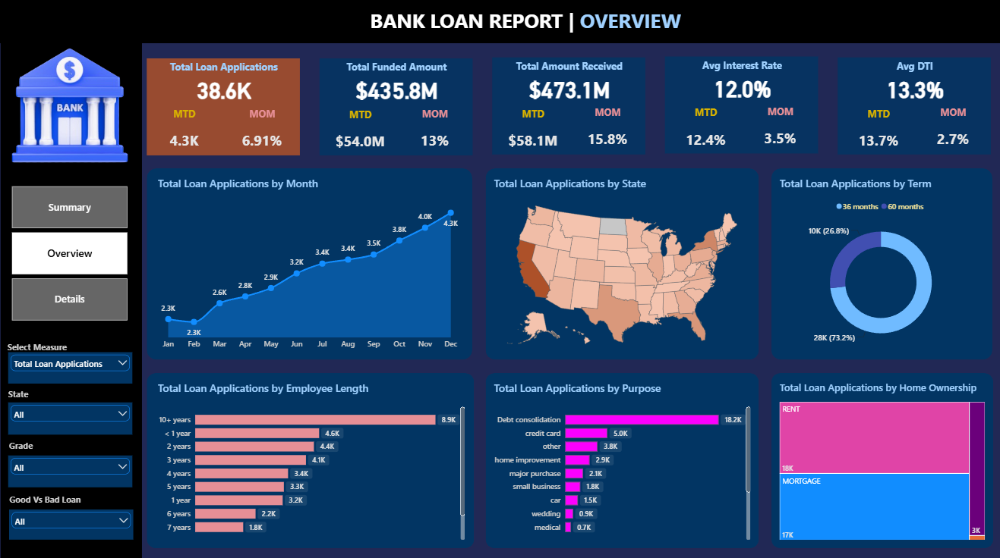
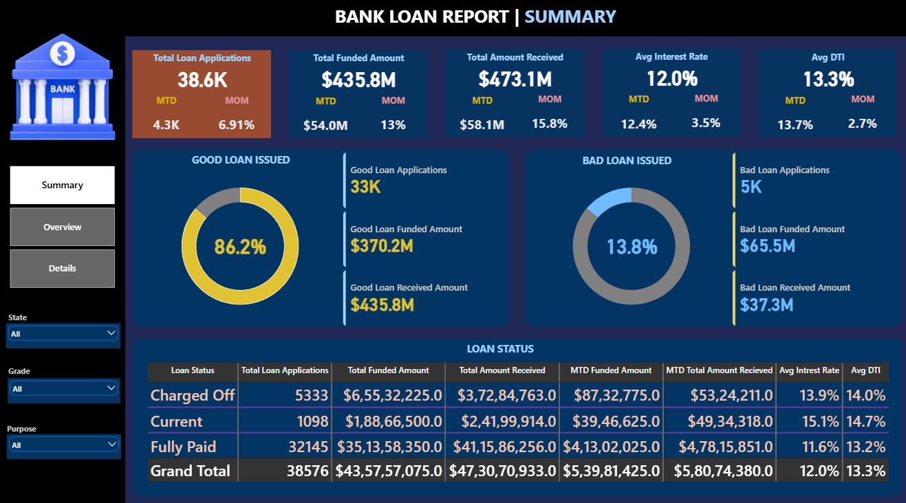
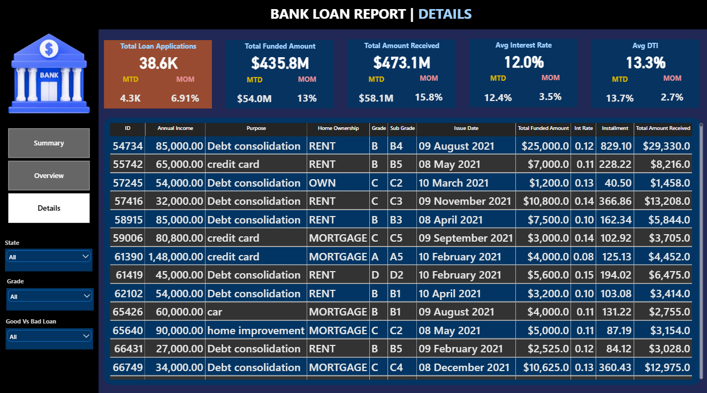

# 📊 Bank Loan Report & Credit Risk Analysis Dashboard

## 📌 Project Overview
This project provides an end-to-end financial data analysis and visualization solution for evaluating Bank Loan Portfolio Health, Credit Risk, and Borrower Profiles. It helps identify high-risk applicant segments, debt-to-income (DTI) thresholds, default rates (Good Loans vs. Bad Loans), and overall financial KPIs (AOV/Average Loan Size, Total Applications, Funded Capital, Cash Recovered) to support data-backed underwriting strategies and operational risk management.

---

## 🎯 Objectives
- Analyze Portfolio KPIs: Evaluate total loan applications, funded capital, and cash received across monthly timelines and loan statuses.
- Assess Risk Exposure: Distinguish between Good Loans (Fully Paid / Current) and Bad Loans (Charged Off / Default Risk).
- Segment Borrower Profiles: Analyze loan distributions across loan terms (36 vs 60 months), employment length, debt-to-income (DTI) ratios, and homeownership categories.
- Identify Regional & Grade Vulnerabilities: Highlight high-risk credit grades (F & G) and geographical loan originations.
- Generate Strategic Recommendations: Provide data-backed financial policies with explicit numerical targets to minimize default-driven loss.

---

## 🛠️ Tools Used
- **SQL Server** (Data Extraction, Querying, Aggregations, Window Functions, KPI Cross-Verification)
- **Power BI** (Data Modeling, DAX Measures Creation, Dynamic Tooltips, Cross-Filtering, Interactive Dashboards)

---

## 📐 Key Techniques Applied
- Complex SQL Aggregations & CTEs
- Advanced DAX KPI Calculations
- Interactive Drill-Downs & Slicers
- Conditional Formatting & UI/UX Design

---

## 📁 Dataset Overview
- **Total Records:** 38,576 loan applications
- **Key Columns:** id, address_state, application_type, emp_length, emp_title, grade, sub_grade, home_ownership, issue_date, last_credit_pull_date, last_payment_date, loan_status, next_payment_date, member_id, purpose, term, verification_status, annual_income, dti, installment, int_rate, loan_amount, total_acc, total_payment.

---

## 📈 Key Performance Indicators (KPIs)
- **Total Loan Applications:** 38.6K (38,576) | 4.3K MTD | +6.91% MoM
- **Total Funded Amount:** $435.8M ($435,757,075) | $54.0M MTD | +13.00% MoM
- **Total Amount Received:** $473.1M ($473,070,933) | $58.1M MTD | +15.80% MoM
- **Average Interest Rate:** 12.0% | 12.4% MTD | +3.50% MoM
- **Average Debt-to-Income (DTI):** 13.3% | 13.7% MTD | +2.70% MoM

---

## 🔍 Key Insights & Findings

### 1. Portfolio Health & Good vs. Bad Loan Share
- **Good Loans (Fully Paid / Current)** comprise **86.2%** of the portfolio (**33K applications**). Total funded amount is **$370.2M**, generating **$435.8M** in cash received.
- **Bad Loans (Charged Off)** account for **13.8%** of total applications (**5K applications / 5,333 exact**). Total funded capital is **$65.5M ($65,532,225)**, with only **$37.3M ($37,284,763)** recovered, resulting in a net capital loss of **$28.2M**.

### 2. Loan Status & Grade Exposure
- **Fully Paid Loans:** **32,145 applications** (**$351.4M funded, $411.6M received**) with a low average interest rate of **11.6%** and DTI of **13.2%**.
- **Charged Off Loans:** **5,333 applications** (**$65.5M funded, $37.3M received**) carrying a higher average interest rate of **13.9%** and elevated average DTI of **14.0%**.
- **Current Loans:** **1,098 active loans** (**$18.9M funded, $24.2M received**) with an average interest rate of **15.1%** and DTI of **14.7%**.

### 3. Purpose & Term Distribution
- **Primary Loan Purpose:** **Debt Consolidation** heavily dominates total applications at **18.2K applications**, followed by **Credit Card refinancing (5.0K)**, **Home Improvement (2.9K)**, and **Major Purchase (2.1K)**.
- **Loan Term Preference:** **36-month term loans** make up **73.2% (28K)** of overall volume, while **60-month term loans** account for **26.8% (10K)**.

### 4. Borrower Demographic Profile
- **Employment Stability:** Borrowers with **10+ years of employment** form the single largest applicant pool (**8.9K applications**).
- **Home Ownership:** **Renters (18K)** and **Mortgage holders (17K)** constitute **90.7%** of total applicants, whereas home **Owners** represent only **3K applications**.

---

## 💡 Strategic & Actionable Recommendations

- **Cap Allowable DTI for Unsecured Debt:** Restrict approval thresholds for applicants with DTI exceeding **14.0%** (the average DTI for Charged Off accounts) when applying for high-risk categories like Debt Consolidation to reduce defaults by **10–15%**.
- **Mitigate Capital Loss on Defaulted Portfolio:** Implement automated early-warning triggers and proactive restructuring for accounts reaching **60+ days delinquent** to recover a higher portion of the **$28.2M** charged-off capital gap.
- **Incentivize 36-Month Term Originations:** Encourage shorter-term 36-month loans through competitive interest rate banding (currently **11.6%** average on fully paid loans) as 60-month terms demonstrate higher late-stage exposure.
- **Target Low-Risk Demographic Segments:** Expand pre-approved loan campaigns toward borrowers with **10+ years of employment history** and **Mortgage/Owned properties**, who display the highest historical repayment stability.
- **Risk-Based Pricing Adjustments:** Adjust risk-pricing margins on lower credit grades (**D, E, F**) to ensure interest yield adequately covers default provisioning.

---

## 👤 Author
**Rohit Kumar Singh**  
Bank Loan Report Analysis

---

# 🖥️ Dashboard Views

Here are the interactive dashboard screens developed in Power BI for detailed credit risk and portfolio analysis:

---

### 1. Overview Dashboard
*Provides a high-level visual summary of core KPIs, monthly application trends, loan distribution by state, term length, employee tenure, loan purpose, and homeownership status.*

### 2. Summary Dashboard
*Focuses on portfolio health, categorizing performance into Good Loans vs. Bad Loans, and breaking down status-wise loan metrics.*

---

### 3. Details Dashboard
*A granular grid report allowing deep-dive inspection into individual loan accounts, interest rates, installment amounts, and repayment progress.*

